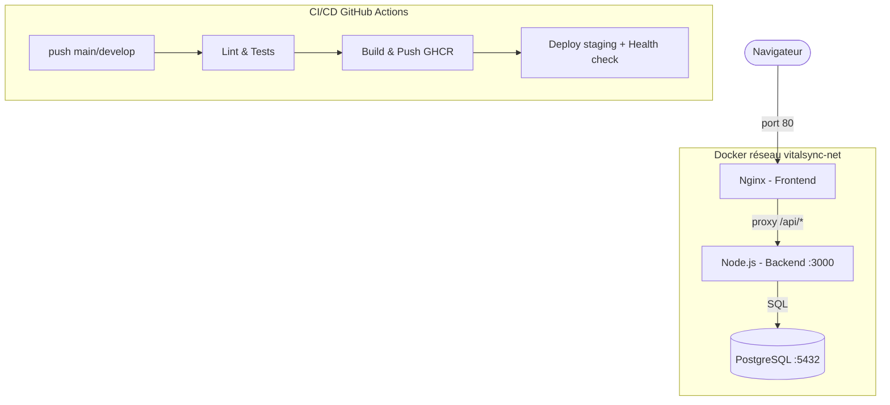
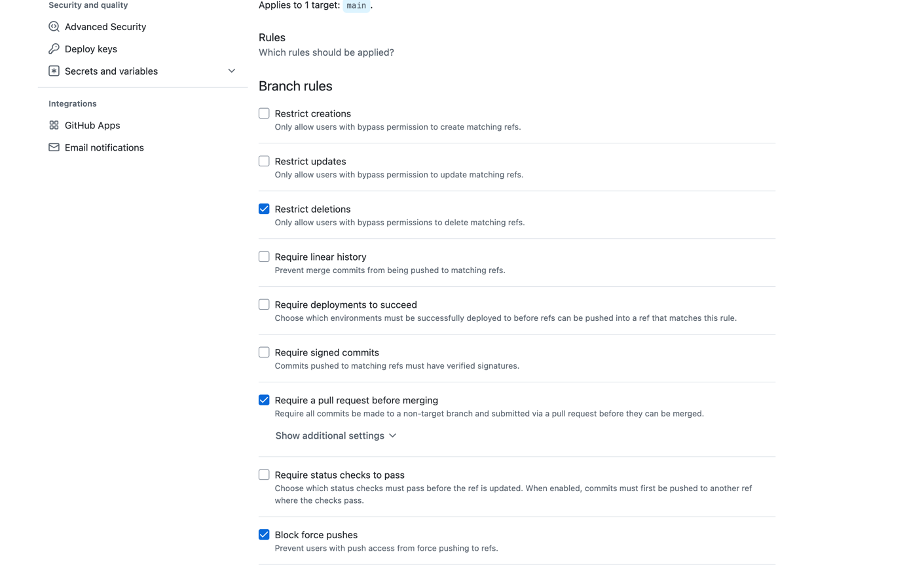
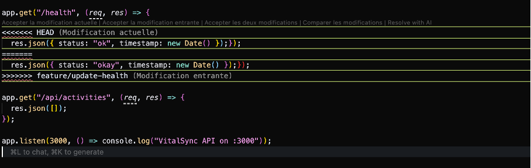
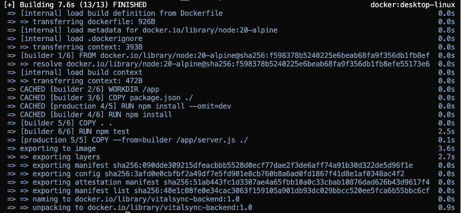
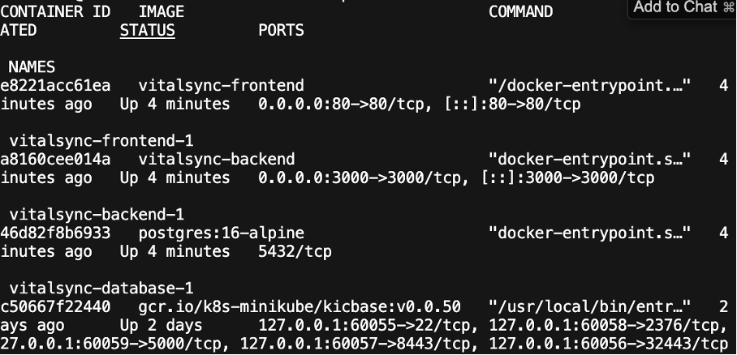
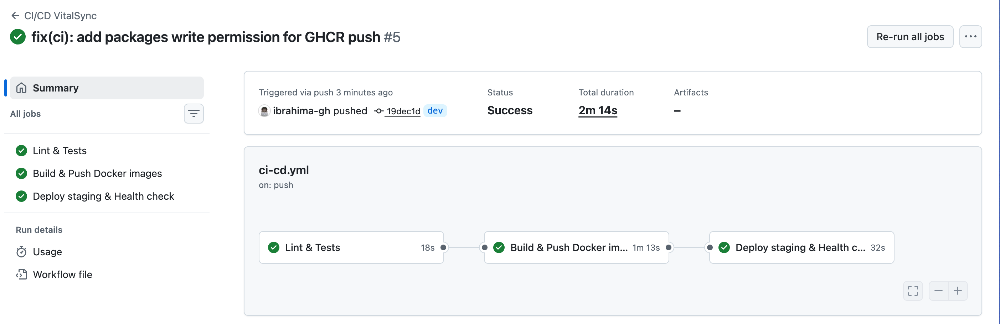
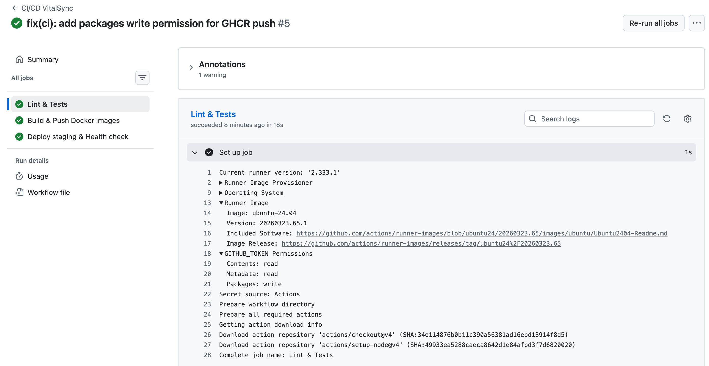
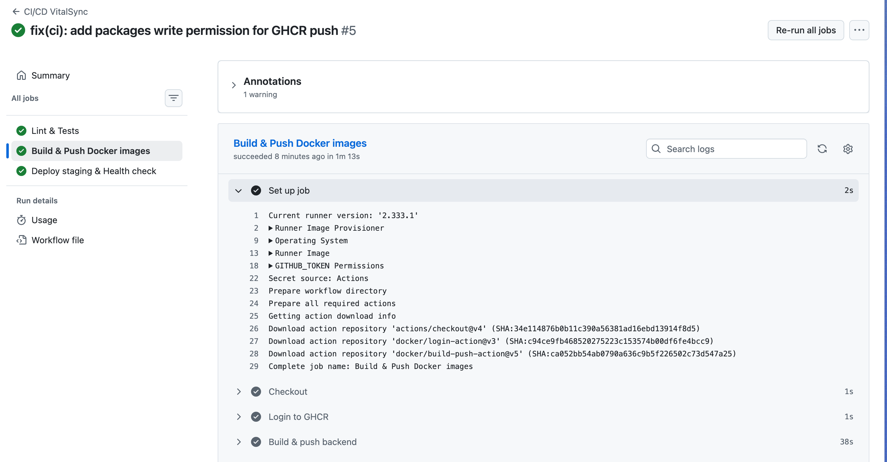
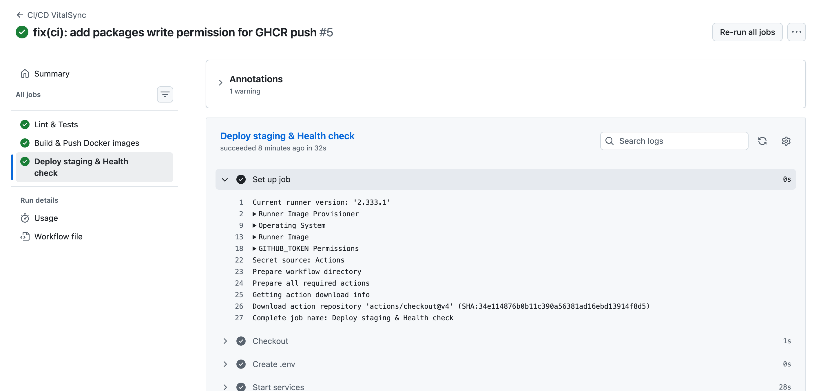

# VitalSync – Compte rendu E6 Chaîne CI/CD conteneurisée
**EFREI 2026 – RNCP39608 Bloc 3**

---

## Table des matières
1. [Description et architecture](#1-description-et-architecture)
2. [Prérequis](#2-prérequis)
3. [Partie 1 – Git et gestion de versions](#3-partie-1--git-et-gestion-de-versions)
4. [Partie 2 – Conteneurisation Docker](#4-partie-2--conteneurisation-docker)
5. [Partie 3 – Pipeline CI/CD](#5-partie-3--pipeline-cicd)
6. [Partie 4 – Orchestration et supervision](#6-partie-4--orchestration-et-supervision)
7. [Partie 5 – Lancer l'application](#7-lancer-lapplication)
8. [Choix techniques](#8-choix-techniques)

---

## 1. Description et architecture

VitalSync est une application de suivi médical et sportif composée de trois services :

- **Backend** : API REST Node.js/Express sur le port 3000
- **Frontend** : page HTML statique servie par Nginx sur le port 80
- **Database** : PostgreSQL 16

### Schéma d'architecture



---

## 2. Prérequis

| Outil | Version minimale |
|---|---|
| Docker | 24+ |
| Docker Compose | v2+ |
| Node.js | 20 LTS |
| Git | 2.40+ |

---

## 3. Partie 1 – Git et gestion de versions

### Exercice 1 – Initialisation et structuration du dépôt

#### Stratégie de branches (Gitflow)

| Branche | Rôle |
|---|---|
| `main` | Code stable, déployé en production |
| `dev` | Intégration continue des features |
| `feature/docker-setup` | Mise en place des Dockerfiles |
| `feature/add-endpoint` | Ajout endpoint `/api/activities` |
| `feature/update-health` | Modification du handler `/health` |

**Screenshot – branches créées :**


#### Fichier `.gitignore`

```gitignore
# Dépendances Node.js : reconstruites via npm install, inutile de versionner
node_modules/

# Variables d'environnement : contiennent des secrets (mots de passe, tokens)
.env
*.env

# Logs applicatifs : générés à l'exécution, pas pertinents dans le dépôt
*.log
npm-debug.log*

# Couverture de tests : générée automatiquement, non versionnée
coverage/

# Fichiers système macOS
.DS_Store

# Build artifacts
dist/
build/
```

> **Justification** : `node_modules/` n'est pas versionné car les dépendances sont déclarées dans `package.json` et reconstruites via `npm install`. `.env` ne doit jamais être commité car il contient des secrets (mots de passe de base de données, tokens API) qui ne doivent pas apparaître dans l'historique Git.

#### Règles de protection sur `main`

- Push direct interdit → obligation de passer par une Pull Request
- Status checks requis (pipeline CI doit passer)
- Force push bloqué

**Screenshot – règles de protection :**



> **Choix GitHub** : GitHub est choisi pour son intégration native avec GitHub Actions et GHCR, sans infrastructure supplémentaire à gérer.

---

### Exercice 2 – Workflow Git et résolution de conflits

#### Création du conflit

Depuis `dev`, deux branches ont modifié la même ligne dans `server.js` :
- `feature/add-endpoint` : change `status: "ok"` en `status: "okay"`
- `feature/update-health` : modifie le même handler `/health`

**Screenshot – marqueurs de conflit :**



Le fichier affiche les marqueurs Git standard :
- `<<<<<<< HEAD` : modification de la branche courante
- `=======` : séparateur
- `>>>>>>> feature/update-health` : modification entrante

La résolution a consisté à conserver la version `"ok"` conforme aux tests.

#### `git merge` vs `git rebase`

| | `git merge` | `git rebase` |
|---|---|---|
| **Principe** | Crée un commit de fusion, conserve l'historique exact | Rejoue les commits sur la branche cible, historique linéaire |
| **Avantage** | Transparence totale, traçabilité | Historique propre, lisible |
| **Cas recommandé** | Fusion de branches partagées (`feature → develop`) | Mise à jour d'une branche locale avant PR |

> On recommande `merge` pour intégrer des features dans `develop` (traçabilité) et `rebase` pour nettoyer une branche feature avant review (lisibilité).

#### Conventional Commits

Les commits suivent la convention `type(scope): description` :

**Screenshot – historique Git :**


| Commit | Convention appliquée |
|---|---|
| `ci: add github actions pipeline configuration` | `ci:` pour les changements CI/CD |
| `docs: add README with project description` | `docs:` pour la documentation |
| `feat(api): add /api/users endpoint` | `feat(scope):` pour une nouvelle feature |
| `chore: add gitignore for node and environment files` | `chore:` pour les tâches de maintenance |
| `chore: initialize vitalsync project structure` | `chore:` pour l'initialisation |

> **Justification** : Conventional Commits permet de générer automatiquement des changelogs, de classifier les changements (feat/fix/chore) et de déclencher des releases sémantiques via des outils comme `semantic-release`.

---

## 4. Partie 2 – Conteneurisation Docker

### Exercice 3 – Dockerfile back-end (multi-stage build)

```dockerfile
# Multi-stage build : le stage "builder" installe TOUTES les dépendances
# (y compris devDependencies) et exécute les tests dans un environnement isolé.
# Le stage "production" repart de zéro avec une image alpine minimale :
# - les devDependencies (jest, supertest…) ne sont jamais copiées dans l'image finale
# - la surface d'attaque est réduite (moins de binaires, pas d'outils de build)
# - l'image finale est ~3x plus légère qu'avec node:20 standard

# Stage 1 : build & test
FROM node:20-alpine AS builder
WORKDIR /app
COPY package.json ./
RUN npm install
COPY . .
RUN npm test

# Stage 2 : production
FROM node:20-alpine AS production
WORKDIR /app
COPY package.json ./
RUN npm install --omit=dev
COPY --from=builder /app/server.js ./
EXPOSE 3000
CMD ["node", "server.js"]
```

**Pourquoi 2 stages ?**
- **Stage builder** : installe toutes les dépendances (y compris `jest`, `supertest`) et exécute les tests. Si les tests échouent, le build s'arrête — on ne produit jamais d'image sans tests validés.
- **Stage production** : repart d'une image vierge, installe uniquement les dépendances de production (`--omit=dev`). Les outils de test n'existent pas dans l'image finale.

**Pourquoi `node:20-alpine` ?**

| Image | Taille | Choix |
|---|---|---|
| `node:20` (Debian) | ~1 GB | Trop lourd, plein d'outils inutiles |
| `node:20-alpine` | ~180 MB | Alpine Linux minimal, sufficient pour Node.js |

Alpine est basé sur musl libc, plus léger et avec moins de CVE exposées.

#### Fichier `.dockerignore`

```dockerignore
# Dépendances locales : reconstruites dans l'image via npm install
node_modules

# Dockerfile et .dockerignore : ne font pas partie de l'application
Dockerfile
.dockerignore

# Fichiers Git : historique et config inutiles dans le conteneur
.git
.gitignore

# Variables d'environnement : ne jamais embarquer de secrets dans l'image
.env
*.env
```

**Screenshot – build réussi :**



**Screenshot – taille de l'image :**


> L'image `vitalsync-backend:1.0` pèse **323.93 MB** avec `node:20-alpine`.

---

### Exercice 4 – Dockerfile front-end

```dockerfile
# nginx:alpine choisie pour sa légèreté (~25 MB) :
# elle contient uniquement Nginx, sans OS complet ni outils inutiles.

FROM nginx:alpine
RUN rm /etc/nginx/conf.d/default.conf
COPY nginx.conf /etc/nginx/conf.d/default.conf
COPY index.html /usr/share/nginx/html/index.html
EXPOSE 80
CMD ["nginx", "-g", "daemon off;"]
```

#### Fichier `nginx.conf`

```nginx
server {
  listen 80;

  location / {
    root /usr/share/nginx/html;
    index index.html;
    try_files $uri $uri/ /index.html;
  }

  location /api/ {
    proxy_pass http://backend:3000/;
    proxy_set_header Host $host;
    proxy_set_header X-Real-IP $remote_addr;
  }
}
```

**Rôle du `proxy_pass`** : le navigateur ne connaît que Nginx (port 80). Quand le JS fait `fetch("/api/health")`, Nginx intercepte la requête et la redirige en interne vers `backend:3000`. Cela évite les problèmes CORS car tout passe par la même origine.

**Justification `nginx:alpine`** : ~25 MB contre ~190 MB pour `nginx:latest`. Moins de paquets = moins de CVE. Suffisant pour du HTML statique et du proxy.

---

### Exercice 5 – Docker Compose

```yaml
version: '3.8'

services:
  backend:
    build: ./backend
    ports:
      - "3000:3000"
    environment:
      - NODE_ENV=production
      - POSTGRES_USER=${POSTGRES_USER}
      - POSTGRES_PASSWORD=${POSTGRES_PASSWORD}
      - POSTGRES_DB=${POSTGRES_DB}
    depends_on:
      - database
    networks:
      - vitalsync-net

  frontend:
    build: ./frontend
    ports:
      - "80:80"
    depends_on:
      - backend
    networks:
      - vitalsync-net

  database:
    image: postgres:16-alpine
    environment:
      - POSTGRES_USER=${POSTGRES_USER}
      - POSTGRES_PASSWORD=${POSTGRES_PASSWORD}
      - POSTGRES_DB=${POSTGRES_DB}
    volumes:
      - postgres-data:/var/lib/postgresql/data
    networks:
      - vitalsync-net

networks:
  vitalsync-net:
    driver: bridge

volumes:
  postgres-data:
```

**Réseau bridge dédié** : les 3 conteneurs sont isolés du reste de la machine et communiquent entre eux par nom de service (`backend`, `database`). Un conteneur externe ne peut pas atteindre la base de données directement.

**Volume persistant** : sans `postgres-data`, un `docker compose down` supprime le système de fichiers du conteneur — toutes les données PostgreSQL sont perdues. Avec le volume, elles survivent aux redémarrages.

**Variables d'environnement** :

| Variable | Rôle |
|---|---|
| `POSTGRES_USER` | Nom de l'utilisateur PostgreSQL |
| `POSTGRES_PASSWORD` | Mot de passe (secret, jamais en clair dans le code) |
| `POSTGRES_DB` | Nom de la base de données créée au démarrage |

**Fichier `.env.example`** :
```
POSTGRES_USER=
POSTGRES_PASSWORD=
POSTGRES_DB=
```

**Screenshot – `docker compose up` :**



---

## 5. Partie 3 – Pipeline CI/CD

### Exercice 6 – Configuration de la pipeline

**Choix GitHub Actions** : intégration native avec le dépôt GitHub, accès direct à GHCR sans token supplémentaire via `GITHUB_TOKEN`, marketplace d'actions riche.

```yaml
name: CI/CD VitalSync

on:
  push:
    branches: [main, develop]
  pull_request:
    branches: [main]

jobs:
  # Étape 1 – Lint & Tests
  lint-test:
    runs-on: ubuntu-latest
    steps:
      - uses: actions/checkout@v4
      - uses: actions/setup-node@v4
        with: { node-version: '20' }
      - run: npm install
        working-directory: backend
      - run: npm run lint      # ESLint
        working-directory: backend
      - run: npm test          # Jest
        working-directory: backend

  # Étape 2 – Build & Push Docker (GHCR)
  build-push:
    needs: lint-test
    runs-on: ubuntu-latest
    steps:
      - uses: actions/checkout@v4
      - uses: docker/login-action@v3
        with:
          registry: ghcr.io
          username: ${{ github.actor }}
          password: ${{ secrets.GITHUB_TOKEN }}
      - uses: docker/build-push-action@v5
        with:
          context: ./backend
          push: true
          tags: |
            ghcr.io/.../vitalsync-backend:latest
            ghcr.io/.../vitalsync-backend:${{ github.sha }}

  # Étape 3 – Deploy staging + Health check
  deploy-staging:
    needs: build-push
    runs-on: ubuntu-latest
    steps:
      - uses: actions/checkout@v4
      - run: docker compose up -d --build
      - name: Health check (échoue si pas de réponse)
        run: |
          for i in $(seq 1 15); do
            curl -sf http://localhost:3000/health && exit 0
            sleep 3
          done
          exit 1
```

**Explication de chaque étape :**

| Étape | Ce qu'elle fait | Pourquoi |
|---|---|---|
| `lint-test` | ESLint + Jest | Détecte les erreurs de code avant tout build |
| `build-push` | Build images + push GHCR tagué `:SHA` | Image traçable, chaque commit a sa propre image |
| `deploy-staging` | Lance docker compose, curl `/health` 15 fois | Vérifie que le déploiement est fonctionnel |

**Tag par SHA de commit** : contrairement à `:latest` qui écrase l'image précédente, le SHA identifie précisément quelle version tourne. En cas de bug, on peut rollback vers un SHA précis.

**GHCR** : registry intégré à GitHub, authentification via `GITHUB_TOKEN` automatique — pas de secret supplémentaire à gérer.

**Health check** : le script fait 15 tentatives (toutes les 3 s). Si aucune ne réussit, `exit 1` fait échouer la pipeline. En cas d'échec, les logs du conteneur sont affichés pour faciliter le diagnostic.

**Screenshot – vue globale pipeline :**



**Screenshot – Lint & Tests :**



**Screenshot – Build & Push :**



**Screenshot – Deploy staging & Health check :**



---

### Exercice 7 – Secrets et déclencheurs

**Secrets configurés** :

| Secret | Rôle |
|---|---|
| `GITHUB_TOKEN` | Automatique — authentification GHCR et push d'images |
| `POSTGRES_USER` | Nom d'utilisateur PostgreSQL (staging) |
| `POSTGRES_PASSWORD` | Mot de passe PostgreSQL (staging) |
| `POSTGRES_DB` | Nom de la base de données (staging) |

**Déclencheurs** :

```yaml
on:
  push:
    branches: [main, dev]   # Pipeline sur chaque push
  pull_request:
    branches: [main]        # Pipeline sur chaque PR vers main
```

> La pipeline tourne sur `dev` pour détecter les bugs en cours de développement, et sur les PR vers `main` pour garantir que rien de cassé n'atteint la production.

**Pourquoi ne jamais stocker de secrets en clair dans le CI ?**

1. **Exposition dans l'historique Git** : un secret commité reste accessible dans `git log` même après suppression — l'historique est immuable et public sur GitHub.
2. **Logs de pipeline** : un secret en clair dans un `echo` ou une variable non masquée apparaît dans les logs consultables par tous les membres du projet (voire publiquement sur les repos open source).

---

## 6. Partie 4 – Orchestration et supervision

### Exercice 8 – Manifestes Kubernetes

#### Deployment backend

```yaml
apiVersion: apps/v1
kind: Deployment
metadata:
  name: vitalsync-backend
spec:
  replicas: 2
  selector:
    matchLabels:
      app: vitalsync-backend
  template:
    metadata:
      labels:
        app: vitalsync-backend
    spec:
      containers:
        - name: backend
          image: ghcr.io/YOUR_USERNAME/vitalsync-backend:latest
          ports:
            - containerPort: 3000
          env:
            - name: POSTGRES_PASSWORD
              valueFrom:
                secretKeyRef:
                  name: postgres-secret
                  key: POSTGRES_PASSWORD
          livenessProbe:
            httpGet:
              path: /health
              port: 3000
            initialDelaySeconds: 10
            periodSeconds: 15
            failureThreshold: 3
```

#### Service ClusterIP

```yaml
apiVersion: v1
kind: Service
metadata:
  name: vitalsync-backend
spec:
  type: ClusterIP
  selector:
    app: vitalsync-backend
  ports:
    - port: 3000
      targetPort: 3000
```

#### Ingress frontend

```yaml
apiVersion: networking.k8s.io/v1
kind: Ingress
metadata:
  name: vitalsync-ingress
spec:
  rules:
    - host: vitalsync.local
      http:
        paths:
          - path: /
            pathType: Prefix
            backend:
              service:
                name: vitalsync-frontend
                port:
                  number: 80
```

#### Secret PostgreSQL

```yaml
apiVersion: v1
kind: Secret
metadata:
  name: postgres-secret
type: Opaque
stringData:
  POSTGRES_USER: <your_db_user>
  POSTGRES_PASSWORD: <your_db_password>
  POSTGRES_DB: <your_db_name>
```

**Rôle de chaque ressource :**

| Ressource | Rôle |
|---|---|
| `Deployment` | Déclare l'état désiré : 2 réplicas du backend, image à utiliser, variables d'env |
| `Service (ClusterIP)` | Expose le backend en interne au cluster via un nom DNS stable (`vitalsync-backend:3000`) |
| `Ingress` | Point d'entrée externe : route le trafic HTTP vers le frontend selon les règles définies |
| `Secret` | Stocke les credentials PostgreSQL chiffrés, injectés comme variables d'environnement dans le pod |

**Pourquoi 2 réplicas ?** Un seul replica crée un point de défaillance unique (SPOF). Deux réplicas permettent la haute disponibilité : si un pod tombe, l'autre continue à servir le trafic pendant que Kubernetes recrée le pod défaillant. Trois réplicas serait justifié sous forte charge.

**Liveness probe** : Kubernetes appelle `GET /health` toutes les 15 secondes. Après 3 échecs consécutifs, il redémarre automatiquement le conteneur. Cela détecte les états de deadlock où le process tourne mais ne répond plus.

**Ingress vs NodePort** : l'Ingress est préféré car il permet le routage par hostname et path, le TLS termination, et centralise le trafic entrant. NodePort expose un port sur chaque nœud du cluster — moins flexible et moins sécurisé en production.

**Injection du Secret** : via `secretKeyRef`, chaque clé du Secret est injectée comme variable d'environnement individuelle dans le pod. Le Secret est chiffré at rest dans etcd et n'apparaît pas en clair dans les manifestes.

---

### Exercice 9 – Supervision

**Stack de supervision choisie :**

| Outil | Rôle |
|---|---|
| **Prometheus** | Collecte des métriques (scraping) |
| **Grafana** | Visualisation des métriques et dashboards |
| **Alertmanager** | Envoi d'alertes (Slack, email) selon des règles |
| **Loki** | Agrégation des logs des conteneurs |

**Métriques surveillées :**

| Métrique | Justification |
|---|---|
| CPU / mémoire par pod | Détecte les fuites mémoire et les pics de charge |
| Latence API (p99) | Mesure l'expérience utilisateur réelle |
| Taux d'erreur 5xx | Alerte immédiate si l'API renvoie des erreurs serveur |
| Nombre de pods actifs | Détecte les crashloops |
| Espace disque PostgreSQL | Prévient les pannes de base de données |

**Self-healing Kubernetes** : quand un pod tombe, le `ReplicaSet` détecte que le nombre de pods actifs est inférieur à `replicas: 2`. Il crée immédiatement un nouveau pod. La liveness probe détecte les pods qui tournent mais ne répondent plus et les redémarre. Ce mécanisme est entièrement automatique, sans intervention humaine.

---

## 7. Lancer l'application

```bash
# Cloner le dépôt
cd vitalsync

# Configurer les variables d'environnement
cp .env.example .env
# Éditer .env avec vos valeurs

# Lancer les 3 services
docker compose up --build

# Vérifier que tout fonctionne
curl http://localhost:3000/health
# → {"status":"ok","timestamp":"..."}

# Ouvrir le frontend
open http://localhost
```

**Commandes utiles :**

```bash
# Arrêter sans supprimer les données
docker compose stop

# Arrêter et supprimer les conteneurs (volume conservé)
docker compose down

# Supprimer aussi les données PostgreSQL
docker compose down -v

# Voir les logs
docker compose logs -f backend
```

---

## 8. Choix techniques

| Technologie | Choix | Justification |
|---|---|---|
| Node.js 20 | Runtime backend | LTS stable, large écosystème npm |
| `node:20-alpine` | Image de base | ~180 MB vs ~1 GB, surface d'attaque réduite |
| `nginx:alpine` | Serveur frontend | ~25 MB, suffisant pour du HTML statique + proxy |
| `postgres:16-alpine` | Base de données | Image officielle, alpine pour la légèreté |
| GitHub Actions | CI/CD | Intégration native avec GitHub, GHCR gratuit |
| GHCR | Registry | Authentification automatique via `GITHUB_TOKEN` |
| Conventional Commits | Convention Git | Génération automatique de changelogs possible |
| Gitflow | Stratégie de branches | Séparation claire dev/staging/prod |
